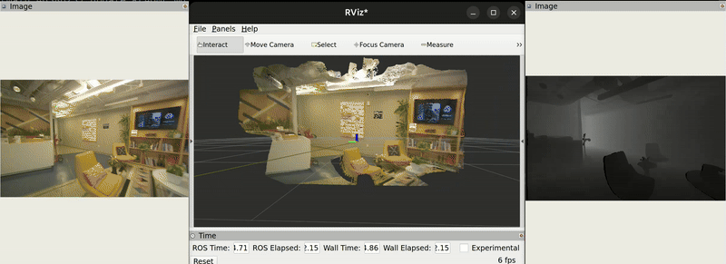
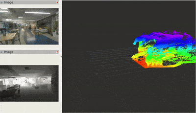
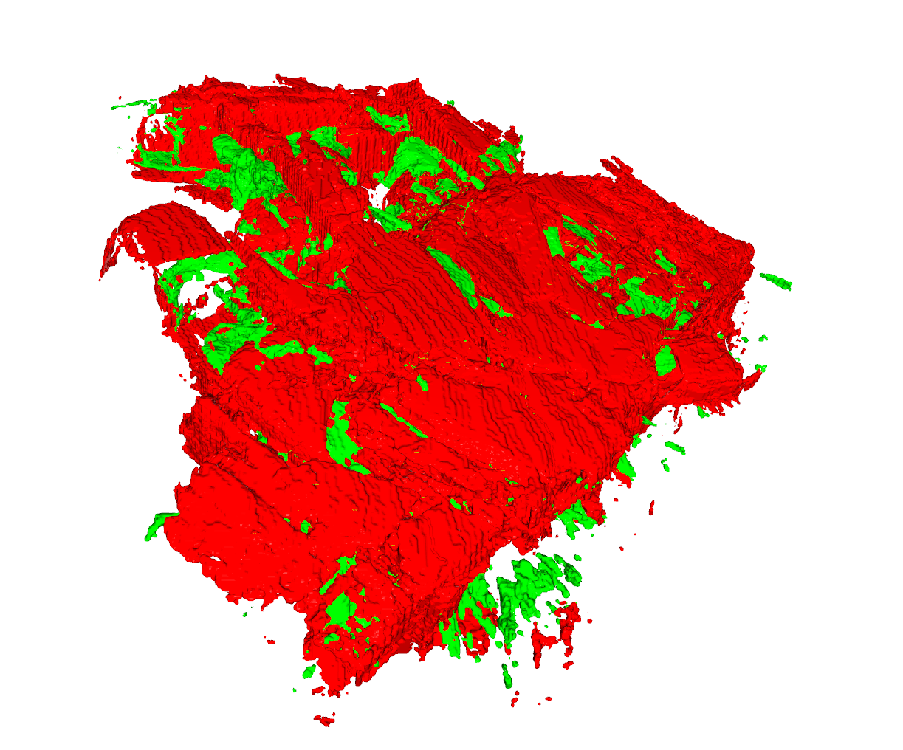

# Computer Vision Project

<p align="center">
  <a href="https://huggingface.co/datasets/OmniInstrument/CV_project">
    
  </a>
</p>


<div align="justify">
This project provides a minimal ROS 2 pipeline for generating a 3D reconstruction from a prerecorded dataset. All components of the reconstruction stack, point cloud generation, odometry, and TSDF fusion are already implemented.<br><br>

Your task is only to produce a metric depth map for each frame.<br>

The system will:
- Convert your depth map into a point cloud
- Fuse it with provided odometry
- Build a TSDF volume
- Export the final mesh

You implement just the depth-estimation step. Everything else is handled automatically.<br>

This assignment assesses your understanding of geometric vision and metric depth recovery from stereo or other cues. Keep the implementation clean, correct, and deterministic.
</div>

<p align="center">
  
</p>

## Dependencies
A Linux Ubuntu computer, or other equivalent. 

You only need to install [Docker](https://docs.docker.com/engine/install/ubuntu/) and follow [Linux Post-Installation](https://docs.docker.com/engine/install/linux-postinstall/) to get started.

<details>
  <summary><strong>GPU Support (Optional)</strong></summary>

If your system includes an NVIDIA GPU, you can enable GPU acceleration inside Docker.

**Install:**
- [NVIDIA GPU drivers](https://www.nvidia.com/en-us/drivers/)
- [NVIDIA Container Toolkit](https://docs.nvidia.com/datacenter/cloud-native/container-toolkit/latest/install-guide.html)
</details>

## Getting Started
Clone the repo

```shell
git clone --recursive https://github.com/omniinstrument/CV_project.git
```
Start the Docker environment

```shell
bash scripts/start.sh
```

> [!NOTE]
> This will automatically run a multi-stage docker container creation, pull all the datasets from Hugging Face too and build the ROS 2 workspace.
> Dataset download will occur only once.

<details>
  <summary><strong>GPU Support (Optional)</strong></summary>
If your system includes an NVIDIA GPU, you can enable GPU acceleration inside Docker.

```shell
bash scripts/start_cuda.sh
```

> Make sure to change base image based on you CUDA version, which can be checked using `nvidia-smi`

> The default base image is `nvcr.io/nvidia/tensorrt:25.11-py3`, ensure this is changed to match your hardware. 

</details>

## Cyclone DDS tuning

The Linux kernel must be optimized to use large packet sizes. This can be done using the script provided and is done outside docker.

```shell
cd usb_dds_setup && bash install_ipfrag.sh
```

> [!NOTE]
> You need `sudo` to change this.

You can refer to further documentation [here](https://autowarefoundation.github.io/autoware-documentation/main/installation/additional-settings-for-developers/network-configuration/dds-settings/) or [here](https://docs.ros.org/en/jazzy/How-To-Guides/DDS-tuning.html).

## Demo
The ROS 2 bag file already includes a metric depth topic from the camera. You will recreate or implement your own version. But this is a good start and demo.

```shell
ros2 launch tsdf_saver saver.launch.py
```

At the end, the launch file should automatically save a mesh (`.stl`) and stop/close the system after 20 seconds.

> [!NOTE]
> The generated mesh is saved in the [output](output) folder.

You can use RVIZ2 to visualize the results.

<p align="center">
  
</p>

> [!WARNING]
> Incase you get an error like `ros2: failed to increase socket receive buffer size to at least 33554432 bytes, current is 425984 bytes` that means you Linux kernel is not tuned for large packets. Refer to [Cyclone DDS tuning](#cyclone-dds-tuning)

### Comparing the Mesh against the Ground Truth
We are providing the ground truth mesh, and a basic code to compute the error/metrics. Use that to iterate upon your solution.
```shell
/opt/venv/bin/python /home/$(whoami)/compute_metrics.py #--view
```
<p align="center">
  
</p>
<p align="center">
  $$\color{red}Red$$ = Ground truth mesh | $$\color{lightgreen}Green$$ = Generated mesh
</p>

## Dataset
The [ROS 2 bag file](https://huggingface.co/datasets/OmniInstrument/CV_project/tree/main/VIO_stripped) has the following topics, you can use these to generate a metric depth map.
### ROS 2 Bag Topics

#### Sensor Topics
| Topic Name                                          | Message Type               |
|:-----------------------------------------------------:|:-----------------------------:|
| `/zed/zedxm/right/color/rect/image`                   | `sensor_msgs/Image`      |
| `/zed/zedxm/right/color/rect/image/camera_info`       | `sensor_msgs/CameraInfo` |
| `/zed/zedxm/right/gray/rect/image`                    | `sensor_msgs/Image`      |
| `/zed/zedxm/right/gray/rect/image/camera_info`        | `sensor_msgs/CameraInfo` |
| `/zed/zedxm/left/color/rect/image`                    | `sensor_msgs/Image`      |
| `/zed/zedxm/left/color/rect/image/camera_info`        | `sensor_msgs/CameraInfo` |
| `/zed/zedxm/left/gray/rect/image`                     | `sensor_msgs/Image`      |
| `/zed/zedxm/left/gray/rect/image/camera_info`         | `sensor_msgs/CameraInfo` |

#### TF Frames
The stereo pair exposes two TF frames — `zed_left_camera_frame_optical` and `zed_right_camera_frame_optical` — whose relative transform encodes the `baseline` between the cameras. This baseline is required for converting disparity into metric depth. 
<p align="center">
<pre>
                        +-----------------------+
                        |      Stereo Rig       |
                        +-----------------------+
                               (baseline)
                <------------------------------------->  
          left_camera---------------------------right_camera
                ^                                      ^
                |                                      |
  zed_left_camera_frame_optical           zed_right_camera_frame_optical
</pre>
</p>

## Launch file
The [launch file](ros2_ws/src/tsdf_saver/launch/saver.launch.py) must be modified to include your custom ROS 2 package if needed. There is a section to include to your ROS 2 node, ensure the topics are remapped below. 

### ROS 2 package
You can start by creating a ROS 2 package for computing the metric depth map. There is enough information in the provided ROS 2 topics to generate this data.

You can refer to the [offical documentation](https://docs.ros.org/en/jazzy/Tutorials/Beginner-Client-Libraries/Creating-Your-First-ROS2-Package.html).

#### Tips
You can refer to some [classical algorithms](https://docs.opencv.org/4.x/dd/d53/tutorial_py_depthmap.html) to come up with a basic solution.


## Instructions
- You are free to generate depth maps any way possible, this includes classical methods or using Neural Networks. 
- You are free to use any external libraries.
- You are free to use AI code editors or AI agents, your code can be 100% AI generated.
- You are free to perform monocular depth estimation if that will yeild better results.
- You are free to use any programming languages like Python, C++, Rust and/or CUDA.
- **You are not allowed to modify the [compute_metrics](src/compute_metrics.py) file.** But you are allowed to modify rest of the codebase. 

### Submission
Upload the [output directory](output) and share it with us.

## Bugs/Support
If you come across any bugs or have questions feel free to open an Issue or reach out to Jagennath Hari(hari@omniinstrument.com).

## License
This software and dataset are released under the [MIT License](LICENSE).

## Acknowledgment
This work integrates several powerful research papers, libraries, and open-source tools:

- [**DB-TSDF**](https://robotics-upo.github.io/DB-TSDF/)
